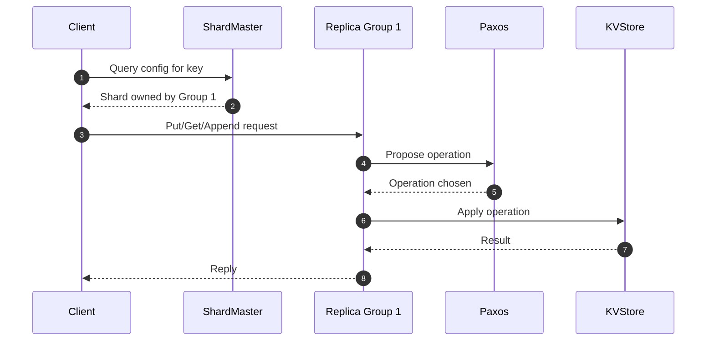

# Single-Key Request Sequence

```mermaid
sequenceDiagram
    autonumber

    participant C as Client
    participant SM as ShardMaster
    participant G1 as Replica Group 1
    participant P as Paxos
    participant KV as KVStore

    C->>SM: Query config for key
    SM-->>C: Shard owned by Group 1
    C->>G1: Put/Get/Append request
    G1->>P: Propose operation
    P-->>G1: Operation chosen
    G1->>KV: Apply operation
    KV-->>G1: Result
    G1-->>C: Reply
```
